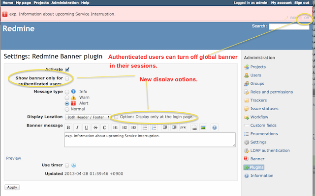

# Redmine Banner Plugin

Plugin to show site-wide message from site administrator, such as maintenance
information or notifications.

[](http://www.redmine.org/plugins/redmine_banner)
[](https://circleci.com/gh/akiko-pusu/redmine_banner/tree/master)
[](https://sider.review/features)



## Plugin installation

1. Copy the plugin directory into the $REDMINE_ROOT/plugins directory. Please
    note that plugin's folder name should be **"redmine_banner"**. If
    changed, some migration task will be failed.
2. Do migration task.

    e.g. rake redmine:plugins:migrate RAILS_ENV=production

3. (Re)Start Redmine.

## Uninstall

Try this:

* rake redmine:plugins:migrate NAME=redmine_banner VERSION=0
    RAILS_ENV=production

## Usage for site wide banner

1. Go to plugin's page and click "Settings" link of Redmine Banner Plugin.
You can edit banner message and select style for message. Also you can access setting page from administration menu, click "banner" icon.


### Usage for project scope banner

1. Banner can be used as project module. If you want to manage the banner for your project, "Manage Banner" permission is required to your role.

2. Go to project settings tab and check "Banner" as project module.
3. Then you can see "Banner" tab on project settings page.

### Current limitations

1. Banner for each project does not support timer.
2. Banner for each project is located at the top of the project only. (Not support footer)

### Note

Please use ver **0.1.x** or ``v0.1.x-support-Redmine3`` branch in case using Redmine3.x.

## Changelog

### 0.3.1

* Feature: Enabled to switch who can see the global banner. (#126)
* Refactor: Change to use project menu to prevent the project setting tab's conflict. (#127)

### 0.3.0

* Add feature: Give the ability to specific users to manage the site-wide banner. (GitHub: #86 / #113)
  * Administrator can assign a group to manage global banner via UI.
* Code refactoring for maintainability.
* Change not to use SettingsController's patch to the update global banner.

### 0.2.2

This is bugfix release against 0.2.1.
Updating to 0.2.2 is highly recommended!

* Fix: Prevent conflict with other plugins. (GitHub: #121)
* French translation update by sparunakian (GitHub: #117)

### 0.2.1

* Fix: Prevent conflict with CKEditor. (GitHub: #111)
* Code refactoring.
* Add feature to update Global Banner via API. (Alpha / Related: #86 #113)
  * Not only Redmine admin but also user who assigned group named **GlobalBanner_Admin** can also update Global banner via API.
  * Even prptotype version.
  * Please see [swagger.yml](script/swagger.yml) to try update global banner via API.
* Update CI Setting
  * Add step to build and push image to AWS ECR.
  * Add steps to build and deploy to Heroku Container registry as release container service.
* Add how to try banner via Docker in README.

### 0.2.0

* Support Redmine 4.x.
  * Now master branch **unsupports** Redmine 3.x.
  * Please use ver **0.1.x** or ``v0.1.x-support-Redmine3`` branch in case using Redmine3.x.
  * <https://github.com/akiko-pusu/redmine_banner/tree/v0.1.x-support-Redmine3>
* Follow Redmine's preview option to the wiki toolbar.

NOTE: Mainly, maintenance, bugfix and refactoring only. There is no additional feature, translation in this release.

### 0.1.2

* Fix style and css selector. (Github: #45)
* Change global banner style for responsive mode. (Github: #68)
* Code refactoring.
* Fix: Prevent deprecation warning. (Github PR: #60) Thanks, Wojciech.
* Refactor: Rename file to prevent conflict (Github #63 / r-labs: 54).
* i18n: Update Italian translation file. (Github: #61 / r-labs: 57) Thanks, R-i-c-k-y.
* i18n: Add Spanish translation file. (Github: #61 / r-labs: 52) Thanks Picazamora!
* i18n: Update Turkish translation file. (Github: #64) Thank you so much, Adnan.
* i18n: Update Portuguese translation file. (Github: #50) Thanks, Guilherme.

### 0.1.1

* Support Redmine 3.x.
* Update some translation files. Bulgarian, German. Thank you so much, Ivan Cenov, Daniel Felix.
* Change column type of banner_description from string to text.Thank you so much Namezero. (#44)

### 0.1.0

* Fixed bug: Global banner timer does not work. (r-labs: #1337)
* Feature: Add related link field for more information to Global Banner. (r-labs: #1339)
* i18n: Update Korean translation file. (r-labs: #1329) Thank you so much, Ki Won Kim.

### 0.0.9

* Authenticated users can turn off global banner in their session.
* Add option to show global banner only for authenticated users.
* Add option to show only at the login page.
* Code refactoring.
* Italian translation was contributed by @R-i-c-k-y.
* French translation was contributed by Laurent HADJADJ.

### 0.0.8

* Support Redmine 2.1. (Redmine 2.0.x is no longer supported. Please use version 0.0.7 for Redmine 2.0.x)

### 0.0.7

* Compatible with Redmine 2.0.0

### 0.0.6

* Fixed bug: Project banner should be off when module turned disabled.
* Fixed bug: In some situation, "ActionView::TemplateError undefined method is_action_to_display" is happened.
* Update Russian Translation. Thank you so much, Александр Ананьев.

### 0.0.5

* Support banner for each project. Thank you so much, Denny Schäfer, Haru Iida.

### 0.0.4

* Support timer function.
* Add links to turn off or modify banner message quickly. (Links are shown to Administrator only)

### 0.0.3

* Code refactoring. Stop to override base.rhtml and use javascript. Great thanks, Haru Iida-san. Also, remove some "To-Do" section of README.

* Add translations. Russian, German, Brazilian Portugues. Thank you so much, Александр Ананьев, Denny Schäfer, Maiko de Andrade!

### 0.0.2

* Support i18n.

### 0.0.1

* First release

### Quick try with using Docker

You can try quickly this plugin with Docker environment.
Please try:

```bash
# Admin password is 'redmine_banner_commit_sha'
% git clone https://github.com/akiko-pusu/redmine_banner
% cd redmine_banner
% docker-compose up web -d

# or
#
# Admin password is 'redmine_banner_{COMMIT}'
% docker build --build-arg=COMMIT=$(git rev-parse --short HEAD) \
  --build-arg=BRANCH=$(git name-rev --name-only HEAD) -t akiko/redmine_banner:latest .

% docker run -p 3000:3000 akiko/redmine_banner:latest
```

### Run test

Please see wercker.yml for more details.

```bash
% cd REDMINE_ROOT_DIR
% cp plugins/redmine_banner/Gemfile.local plugins/redmine_banner/Gemfile
% bundle install --with test
% export RAILS_ENV=test
% bundle exec ruby -I"lib:test" -I plugins/redmine_banner/test \
  plugins/redmine_banner/test/functional/banner_controller_test.rb
```

or

```bash
% bundle exec rails redmine_banner:test
```

### Repository

* <https://github.com/akiko-pusu/redmine_banner>

### WebPage

* <http://www.r-labs.org/projects/banner> (Project Page)

### License

This software is licensed under the GNU GPL v2. See COPYRIGHT and COPYING for
details.
